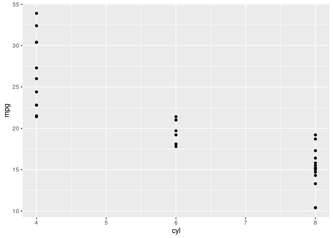
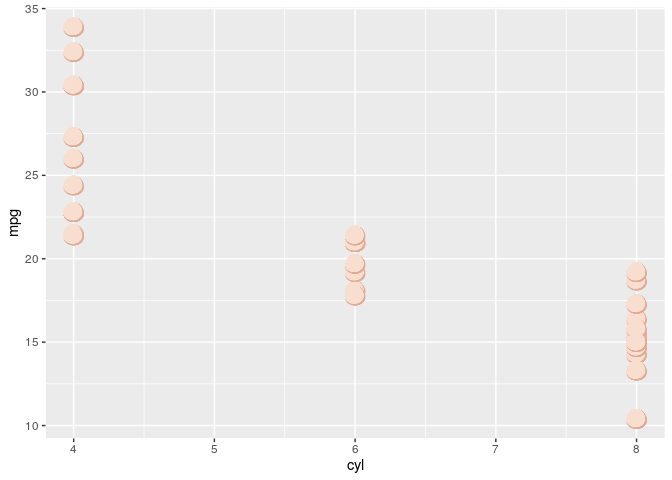

Known: grammar of graphics plot
-------------------------------

Boring `ggplot2` version:

    library(ggplot2)

    p <- ggplot(mtcars, aes(cyl, mpg))

    p + geom_point()

Aim: eggstended grammar of graphics plot
----------------------------------------

What we want to achieve at the end of the heggaton:

    #devtools::install_github("BIMSB-egg-club/eggplot2")
    library(eggplot2)

    p + geom_point()

### Starting point

How the above plot was eggtually created:

    #devtools::install_github("dill/emoGG")
    library(emoGG)

    p + geom_emoji(emoji = "1f95a")

Here are some useful links to get started:

-   minimal git package guide: <https://kbroman.org/pkg_primer>
-   basic git workflow: <https://try.github.io>
-   full package/devtools resource: <https://r-pkgs.org/intro.html>

----
